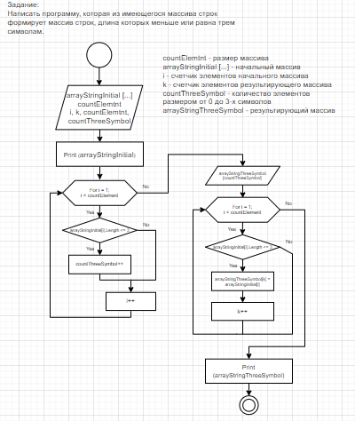

## Итоговое задание: написать программу,
## которая из имеющегося массива строк формирует массив из строк,
## длина которых меньше или равна трем символам.

## Решение задачи:

### Составляем блок-схему решения:

Определяем переменные, необходимые в процессе реализации задачи:

1. arrayStringInitial - исходный массив;
2. arrayStringThreeSymbol - результирующий массив;
3. i, k - счетчики исходного и результирующего массивов;
4. countElement - количество элементов исходного массива;
5. countThreeSymbol - контейнер для подсчета элеметов исходного массива длинной от 0 до 3-х элементов;
 
В программе используем два метода:
1. InputArray 
2. OutPutArray

**InputArray** для получения массива с клавиатуры. **OutPutArray** - для вывода исходного и результирующего массивов на экран.

*Программа выполняется следующим образом:*

Количество элементов в исходном массиве получаем запросом ко пользователю:
*"Введите количество элементов массива:  "* - и присваиваем полученное значение переменной **countElement**.

Вызывем метод **InputArray**, пользователь вводит строковые элементы.

Вызываем метод **OutPutArray** и выводим на экран исходный массив.

Далее организуем цикл для подсчета элеметов исходного массива, размером от 0 до 3 символов. 
Получаем значение переменной **countThreeSymbol**.
        
После этого в новом цикле перебираем элементы исходного массива **arrayStringInitial** и выбираем из них элементы, имеющие от 0 до 3-х симоволов, формируя из них результирующий массив **arrayStringThreeSymbol**.

По окончании работы цикла снова вызываем метод **OutPutArray**, выводим уже результирующий массив **arrayStringThreeSymbol**
